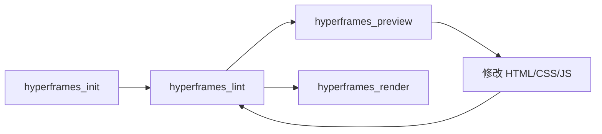

# TimeVerse HyperFrames MCP

将 [HyperFrames](https://github.com/heygen-com/hyperframes) CLI（HTML/CSS/JS 转视频渲染引擎）包装为 **MCP 工具服务**，让 AI Agent 可以直接：
- 创建/初始化视频项目
- 实时预览 HTML 视频（热重载）
- 渲染为 MP4/WebM
- 检查语法完整性
- 文本转语音 / 音频转录
- 检测运行环境、性能基准测试

## 架构概览

```
MCP 客户端（如 TimeVerseStudio）
        │  (stdio 协议)
        ▼
┌─────────────────────────────────────┐
│       server.py (FastMCP)           │
│  ┌─ 后台预热 npx 缓存（首次启动）   │
│  └─ 注册 13 个 MCP 工具              │
└────────────┬────────────────────────┘
             │
    ┌────────┼────────────┬──────────┐
    ▼        ▼            ▼          ▼
  init.py  render.py  media.py   system.py
  lint.py  preview.py
             │
             ▼
┌─────────────────────────────┐
│  cli_executor.py             │
│  ┌─ 优先全局 hyperframes    │
│  │  回退 npx hyperframes    │
│  ├─ 超时/错误处理           │
│  └─ 环境检测 / lint 解析    │
└────────────┬────────────────┘
             │
             ▼
    hyperframes CLI (npx)
```

## 前置依赖

| 依赖 | 要求 | 安装 |
|---|---|---|
| **Python** | >= 3.11 | `brew install python@3.11` |
| **Node.js** | >= 22 | [nodejs.org](https://nodejs.org) |
| **FFmpeg** | 任意版本 | macOS: `brew install ffmpeg` / Ubuntu: `sudo apt install ffmpeg` |
| **HyperFrames** | 自动通过 npx 获取 | 无需手动安装 |

首次运行时会自动通过 npx 下载 hyperframes 包（约 30-60 秒），后续缓存到本地。

> **可选优化**：全局安装 hyperframes 可跳过 npx 下载步骤：
> ```bash
> npm install -g hyperframes
> ```

## 安装

### 方式一：pip 安装（推荐）

```bash
pip install -e .
```

安装后可直接运行：
```bash
timeverse-hyperframes-mcp
```

### 方式二：uvx 运行（无需安装）

需要先安装 [uv](https://docs.astral.sh/uv/)：

```bash
# macOS / Linux
curl -LsSf https://astral.sh/uv/install.sh | sh

# 直接通过 uvx 运行（自动下载依赖并缓存）
uvx timeverse-hyperframes-mcp
```

### 方式三：python -m

```bash
python -m timeverse_hyperframes_mcp.server
```

## 注册到 MCP 客户端

### TimeVerseStudio

在 MCP 设置页面点击 **JSON 导入**，填入以下内容：

```json
{
  "mcpServers": {
    "hyperframes": {
      "description": "HyperFrames MCP — 将 HTML/CSS/JS 渲染为 MP4 视频。支持 init / preview / render / lint / TTS / transcribe",
      "command": "uvx",
      "args": ["timeverse-hyperframes-mcp"]
    }
  }
}
```

或通过 API 创建：

```json
{
  "name": "hyperframes",
  "server_type": "local",
  "transport": "stdio",
  "command": "uvx",
  "args": "timeverse-hyperframes-mcp",
  "description": "HyperFrames MCP — 将 HTML/CSS/JS 渲染为 MP4 视频"
}
```

完整示例见 [examples/timeverse-integration.json](examples/timeverse-integration.json)。

### 其他 MCP 客户端（如 Claude Desktop、Cline 等）

使用相同的 stdio 配置：
- **命令**: `uvx timeverse-hyperframes-mcp` 或 `timeverse-hyperframes-mcp`
- **传输协议**: stdio

## 可用工具（共 13 个）

### 项目初始化

| 工具 | 对应 CLI | 参数 | 说明 |
|---|---|---|---|
| `hyperframes_init` | `npx hyperframes init` | `project_name` (必填), `template`, `video_path`, `audio_path`, `parent_dir` | 创建视频项目，支持 9 种模板 |
| `hyperframes_list_templates` | — | 无参数 | 列出所有模板及中文描述 |

支持模板：`blank`（空白）、`warm-grain`（暖色颗粒）、`play-mode`（Play 模式）、`swiss-grid`（瑞士网格）、`vignelli`（Vignelli 风格）、`decision-tree`（决策树）、`kinetic-type`（动态文字）、`product-promo`（产品宣传）、`nyt-graph`（纽约时报数据可视化）

### 视频渲染

| 工具 | 对应 CLI | 参数 | 说明 |
|---|---|---|---|
| `hyperframes_render` | `npx hyperframes render` | `output`, `fps`(24/30/60), `quality`(draft/standard/high), `format`(mp4/webm), `composition`, `workers`(1-8/auto), `gpu`, `docker`, `strict`, `strict_all` | 渲染为 MP4/WebM，支持 GPU 加速和 Docker 可重现构建 |

- `webm` 格式支持透明背景
- 渲染超时默认 10 分钟

### 实时预览

| 工具 | 对应 CLI | 参数 | 说明 |
|---|---|---|---|
| `hyperframes_preview` | `npx hyperframes preview` | `project_dir`, `port`(默认 3002) | 启动本地预览服务，热重载，编辑 HTML 即时更新 |

### 语法检查

| 工具 | 对应 CLI | 参数 | 说明 |
|---|---|---|---|
| `hyperframes_lint` | `npx hyperframes lint` | `project_dir`, `verbose`, `json_output` | 检查 data-composition-id、track 重叠、timeline 注册等问题 |

### 媒体处理

| 工具 | 对应 CLI | 参数 | 说明 |
|---|---|---|---|
| `hyperframes_tts` | `npx hyperframes tts` | `text` (必填), `voice`, `output`, `project_dir` | 文本转语音，生成配音文件 |
| `hyperframes_list_voices` | `npx hyperframes tts --list` | `project_dir` | 列出所有可用 TTS 语音角色（如 af_nova, bf_emma） |
| `hyperframes_transcribe` | `npx hyperframes transcribe` | `input_path` (必填), `model`(tiny/base/small/medium/large), `language`, `output_format`, `project_dir` | 音频/视频转录为字幕 |

### 系统管理

| 工具 | 对应 CLI | 参数 | 说明 |
|---|---|---|---|
| `hyperframes_doctor` | `npx hyperframes doctor` | `project_dir` | 检测 Node.js / npx / FFmpeg 环境，给出安装指引 |
| `hyperframes_info` | `npx hyperframes info` | `project_dir` | 获取 HyperFrames 版本和环境详情 |
| `hyperframes_upgrade` | `npx hyperframes upgrade` | `check_only`, `json_output` | 检查是否有新版本 |
| `hyperframes_compositions` | `npx hyperframes compositions` | `project_dir` | 列出项目中的 composition 文件 |
| `hyperframes_benchmark` | `npx hyperframes benchmark` | `composition`, `project_dir` | 运行渲染性能基准测试 |

## 典型工作流



1. **创建项目**: `hyperframes_init(project_name="my-video", template="kinetic-type")`
2. **语法检查**: `hyperframes_lint(project_dir="my-video")`
3. **实时预览**: `hyperframes_preview(project_dir="my-video")` → 浏览器中编辑 HTML 即改即现
4. **迭代**: 修改 HTML → lint → 预览验证
5. **渲染**: `hyperframes_render(project_dir="my-video", quality="high")` → 输出 MP4

## 环境变量

| 变量 | 说明 | 默认值 |
|---|---|---|
| `HYPERFRAMES_WORKSPACE_DIR` | 视频项目工作目录 | 当前工作目录 |

## 特性

- **智能命令解析**：优先使用全局安装的 `hyperframes`，回退到 `npx hyperframes`
- **后台预热**：服务器启动时自动在后台下载 hyperframes npm 缓存，首次调用更快
- **友好错误提示**：命令超时或环境缺失时给出清晰的修复指引
- **JSON 结构化输出**：lint 结果支持 JSON 格式，便于 AI 解析

## 常见问题

**Q: 首次运行很慢？**
首次运行需要 npx 下载 hyperframes 包（约 30-60 秒），后续会缓存。也可以先全局安装 `npm install -g hyperframes` 跳过 npx 过程。

**Q: 提示"未找到 npx"？**
确认已安装 Node.js >= 22。

**Q: 渲染失败？**
先运行 `hyperframes_doctor` 检测环境是否完整，再运行 `hyperframes_lint` 检查语法。

## 开发者

- 源码：[GitHub](https://github.com/timeverse-tv/timeverse-hyperframes-mcp)
- HyperFrames：https://github.com/heygen-com/hyperframes
